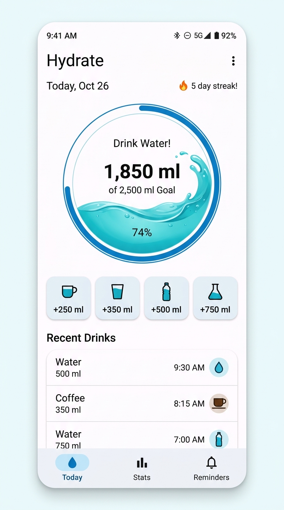

# Water Tracker 💧 | Seguidor de Hidratación

<p align="center">
  
</p>

<p align="center">
  <b>A modern, beautiful, and intuitive daily hydration tracker built with Kotlin and Jetpack Compose.</b><br>
  <i>Una aplicación moderna, atractiva e intuitiva para el seguimiento diario de hidratación creada con Kotlin y Jetpack Compose.</i>
</p>

---

## 🇺🇸 Overview (English)

**Water Tracker** helps you stay consistently hydrated throughout your day. Designed following modern Material 3 guidelines with fluid animations and rich customization, it empowers you to build healthy hydration habits effortlessly.

### ✨ Key Features

- **🌊 Dynamic Fluid Wave Progress**: An interactive circular gauge displaying real-time hydration progress, water ripples, completion percentage, remaining volume, and daily streak counters.
- **⚡ Quick One-Tap Logging**: Presets for common container sizes (+250 ml Cup, +350 ml Glass, +500 ml Bottle, +750 ml Flask) as well as custom volume input.
- **☕ Multi-Beverage Support**: Log different beverage types (Water, Coffee, Tea, Electrolytes, Juice, Soda) with realistic hydration coefficients (e.g., 60% for coffee, 110% for electrolytes).
- **📊 Hydration Analytics & Charts**: Weekly intake bar chart, completion rates, 7-day totals, daily averages, streak milestones, and fluid distribution breakdown.
- **🎯 Smart Goal Calculator**: Tailor daily fluid targets based on body weight, climate temperature, and physical activity level.
- **⏰ Timed Reminders & Quiet Hours**: Push notification alerts with custom frequencies (every 30 mins to 3 hours) and configurable sleep hours.
- **🌐 Full Bilingual Localization**: Switch between English and Spanish (Español) seamlessly from the in-app settings with instant UI updates.
- **🔒 Private & Offline-First**: Built with a local Room SQLite database; all logs, streaks, and preferences stay private on your device.

### 🛠️ Tech Stack & Architecture

- **Language**: Kotlin
- **UI Framework**: Jetpack Compose (Material Design 3)
- **Architecture**: MVVM (Model-View-ViewModel) + Clean Architecture
- **State Management**: StateFlow & Kotlin Coroutines
- **Persistence**: Room Database (SQLite) with KSP
- **Notifications**: Android NotificationManager & Alarm Scheduling

---

## 🇪🇸 Resumen (Español)

**Seguidor de Hidratación** te ayuda a mantener una óptima ingesta de líquidos durante todo el día. Diseñado con las directrices de Material 3, animaciones fluidas y alta personalización, te ayuda a formar hábitos de hidratación saludables fácilmente.

### ✨ Características Principales

- **🌊 Progreso con Ondas de Fluido Interactivas**: Medidor circular dinámico con animación de olas en tiempo real, porcentaje de meta completada, volumen restante y racha de días consecutivos.
- **⚡ Registro Rápido en un Toque**: Accesos directos para envases habituales (+250 ml Taza, +350 ml Vaso, +500 ml Botella, +750 ml Termo) y registro con volumen personalizado.
- **☕ Soporte para Múltiples Bebidas**: Registra distintos tipos de bebida (Agua, Café, Té, Electrolitos, Jugo, Refresco) con coeficientes de hidratación específicos (ej. 60% para café, 110% para electrolitos).
- **📊 Análisis y Gráficos Semanales**: Gráficos de barras de los últimos 7 días, tasa de cumplimiento, totales semanales, promedio diario y distribución por bebida.
- **🎯 Calculadora de Meta Inteligente**: Calcula tu objetivo de hidratación diaria según tu peso corporal, clima y nivel de actividad física.
- **⏰ Recordatorios con Horas de Descanso**: Notificaciones periódicas con frecuencias configurables (de 30 min a 3 horas) y modo no molestar nocturno.
- **🌐 Soporte Bilingüe Completo**: Alterna entre Inglés y Español directamente desde los ajustes de la app con actualización inmediata de la interfaz.
- **🔒 Privado y Sin Conexión**: Desarrollado con base de datos local Room (SQLite); todos tus registros permanecen seguros en tu dispositivo.

### 🛠️ Arquitectura y Tecnologías

- **Lenguaje**: Kotlin
- **Interfaz**: Jetpack Compose (Material Design 3)
- **Patrón**: MVVM (Model-View-ViewModel)
- **Manejo de Estado**: StateFlow y Corrutinas de Kotlin
- **Almacenamiento Local**: Room Database (SQLite) con KSP
- **Notificaciones**: Android NotificationManager y Alarmas del Sistema

---

## 🚀 Building & Running / Compilación y Ejecución

1. Clone this repository / *Clona el repositorio*:
   ```bash
   git clone https://github.com/williamssuarez/Water-Tracker.git
   cd water-tracker
   ```
2. Build the debug APK with Gradle / *Compila el APK con Gradle*:
   ```bash
   gradle assembleDebug
   ```
3. Run unit tests / *Ejecuta las pruebas unitarias*:
   ```bash
   gradle :app:testDebugUnitTest
   ```

---

## Notas de Desarrollador / Developer Notes

ES: Esta aplicacion solo fue desarrollada para que el creador lleve control de su consumo de agua. Sin embargo fue publicada para todos debido a que el desarrollador siente que podria serle util a otras personas

EN: This application was originally developed solely for the creator to track their own water consumption. However, it was released to the public because the developer felt it could be useful to others.

---

## 📄 License / Licencia

This project is licensed under the Apache License 2.0 - see the [LICENSE](LICENSE) file for details.

*Este proyecto está bajo la Licencia Apache 2.0; consulta el archivo [LICENSE](LICENSE) para más detalles.*
